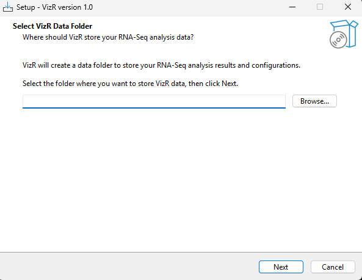

<style>
/* ===== Main Body ===== */
body {
    font-family: "Segoe UI", "Helvetica Neue", Arial, sans-serif;
    line-height: 1.8;
    color: #2c3e50;
    max-width: 960px;
    margin: 0 auto;
    padding: 30px 40px;
}

/* ===== Heading Levels ===== */
h1 {
    color: #0056b3;
    border-bottom: 3px solid #0056b3;
    padding-bottom: 10px;
    margin-top: 50px;
    font-size: 2.2em;
}

h2 {
    color: #2c3e50;
    border-left: 5px solid #0056b3;
    padding: 8px 15px;
    margin-top: 40px;
    background: linear-gradient(to right, #f0f4f8, transparent);
    font-size: 1.6em;
}

h3 {
    color: #34495e;
    border-bottom: 2px solid #e2e8f0;
    padding-bottom: 6px;
    margin-top: 30px;
    font-size: 1.3em;
}

h4 {
    color: #475569;
    margin-top: 24px;
    font-size: 1.1em;
    font-weight: 600;
}

/* ===== Callout Boxes (Reference / Warning / Interpretation) ===== */
blockquote {
    background: #f8fafc;
    border-left: 4px solid #64748b;
    padding: 12px 18px;
    margin: 18px 0;
    font-style: normal;
    color: #475569;
    border-radius: 0 6px 6px 0;
}

/* ===== Inline Code ===== */
code {
    background-color: #f1f5f9;
    padding: 2px 6px;
    border-radius: 4px;
    font-family: "Consolas", "D2Coding", monospace;
    font-size: 0.9em;
    color: #be185d;
}

/* ===== Code Block ===== */
pre {
    background-color: #f6f8fa;
    color: #24292e;
    border: 1px solid #d0d7de;
    padding: 16px 20px;
    border-radius: 8px;
    overflow-x: auto;
    line-height: 1.5;
}
pre code {
    background: none;
    color: inherit;
    padding: 0;
    font-size: 0.88em;
}

/* ===== Table ===== */
table {
    border-collapse: collapse;
    width: 100%;
    margin: 16px 0;
    font-size: 0.95em;
}
thead th {
    background-color: #1e3a5f;
    color: #ffffff;
    padding: 10px 14px;
    text-align: left;
    font-weight: 600;
}
tbody td {
    border: 1px solid #e2e8f0;
    padding: 9px 14px;
    vertical-align: top;
}
tbody tr:nth-child(even) {
    background-color: #f8fafc;
}
tbody tr:hover {
    background-color: #eef2ff;
}

/* ===== Image ===== */
img {
    display: block;
    margin: 24px auto;
    max-width: 100%;
    border: 1px solid #e2e8f0;
    border-radius: 6px;
    box-shadow: 0 2px 8px rgba(0, 0, 0, 0.08);
}

/* ===== Horizontal Rule (Section Divider) ===== */
hr {
    border: none;
    border-top: 1px solid #cbd5e1;
    margin: 32px 0;
}

/* ===== List ===== */
ul, ol {
    padding-left: 24px;
}
li {
    margin-bottom: 4px;
}
li > ul, li > ol {
    margin-top: 4px;
}

/* ===== Bold / Emphasis ===== */
strong {
    color: #1e293b;
}

/* ===== Page Break (For PDF Export) ===== */
.page-break {
    page-break-after: always;
}
</style>

# VizR Workbench User Manual

The workbench is the basic working unit of RNA-Seq analysis. This manual explains the workbench creation process and the function of each screen.

---

## Table of Contents

### Part 1. Workbench Creation Guide

- [Step 1. Basic Setup](#step-1-basic-setup)
  - [1-1. Workbench Name](#1-1-workbench-name)
  - [1-2. Raw Data Source](#1-2-raw-data-source)
  - [1-3. Analysis Species](#1-3-analysis-species)
- [Step 2. Sample Mapping](#step-2-sample-mapping)
  - [2-1. Data Layout](#2-1-data-layout)
  - [2-2. Available Files](#2-2-available-files-file-assignment)
  - [2-3. Sample Mapping Table](#2-3-sample-mapping-table)
- [Step 3. Pipeline Configuration](#step-3-pipeline-configuration)
  - [3-1. Reference Genome](#3-1-reference-genome-settings)
  - [3-2. Quality Control](#3-2-quality-control)
  - [3-3. Sequence Cleaning](#3-3-sequence-cleaning)
  - [3-4. Quantification](#3-4-quantification)
  - [3-5. Differential Expression](#3-5-differential-expression)

### Part 2. Screen Guide

- [1. Workbench Overview](#1-workbench-overview-workbench-list) — Workbench list
- [2. Overview](#2-overview-workbench-detail) — Workbench details, pipeline status
- [3. Raw Data](#3-raw-data-raw-data) — Raw data file status
- [4. Quality Control](#4-quality-control-quality-control) — FastQC quality analysis results
- [5. Preprocessing](#5-preprocessing-preprocessing) — Trimmomatic / PRINSEQ preprocessing results
- [6. Alignment](#6-alignment-alignment) — HISAT2 / Bowtie2 alignment results
- [7. Counts](#7-counts-expression-data) — Expression matrix browsing and analysis
- [8. DEG](#8-deg-differential-expression) — Differential expression analysis (DESeq2 / edgeR)
- [9. PCA](#9-pca-principal-component-analysis) — Principal component analysis
- [10. Clustering](#10-clustering-analysis) — Clustering (Tree / Mfuzz / WGCNA)
- [11. Heatmap](#11-heatmap) — Heatmap visualization
- [12. Venn Diagram](#12-venn-diagram) — Venn diagram

---

<div class="page-break"></div>

## Part 1. Workbench Creation Guide

> Workbench creation consists of three steps: **Basic Setup → Sample Mapping → Pipeline Configuration**

### Step 1. Basic Setup

Click the **Create New Workbench** button on the dashboard to open the creation modal.

### 1-1. Workbench Name

Enter the name of the analysis project.

- Allowed characters: **English letters (A-Z, a-z), numbers (0-9), underscore (`_`), hyphen (`-`)**
- Korean characters, spaces, and special characters are removed automatically
- Duplicate names are validated in real time while typing (green check = available)

```text
Example: Cold_Stress_Experiment, drought-response-2024
```

> ⚠️ **Warning**: The workbench name is also used as a directory name on the server. A concise name that indicates the analysis purpose is recommended.

### 1-2. Raw Data Source

Select one of the three tabs for the data input method. Only the data from the **selected tab** is used in the workbench.

> ⚠️ **Warning**: Even if data is entered in multiple tabs, only the data from the currently active tab is used. If another tab already contains data, a notice message appears at the bottom.

---

#### (A) Local Upload

Upload FASTQ/FASTA files directly from the local PC.

**Supported formats**: `.fastq`, `.fq`, `.fasta`, `.fa`, and compressed `.gz` files

**How to use**:
1. Drag and drop files into the upload area, or click to select them
2. Upload progress is displayed, and a green check appears after completion
3. All uploads must be completed before moving to the next step

> ⚠️ **Warning**: RNA-seq files are often larger than 1GB. Do not close the browser during upload. The Next button remains disabled until the upload is complete.

> ⚠️ **Warning**: If the modal is closed, all uploaded files are deleted. Be careful not to close it by mistake.

---

#### (B) NCBI BioProject

Search and import data from NCBI SRA using a BioProject ID.

**How to use**:
1. Enter a BioProject ID (example: `PRJNA252931`)
2. Click the **Search** button
3. Select the files to use from the result table using checkboxes
4. The layout (SE/PE) is detected and configured automatically

**File selection options**:
- Top checkbox: select or deselect all
- For mixed SE/PE BioProjects, only SE or PE files can be selected in bulk using the corresponding buttons

> ⚠️ **Warning**: SE (Single-End) and PE (Paired-End) files cannot be selected together. Select files with the same layout only.

> ⚠️ **Warning**: Long-read data such as PacBio or Nanopore is detected automatically and excluded. VizR supports Illumina short-read data only.

---

#### (C) From Server

Specify FASTQ/FASTA files that already exist on the server by path.

> ⚠️ **Warning**: Files recognized by VizR are restricted to the **VizR Data Folder (`/vizr`)**. Files in other server locations cannot be accessed by VizR, so they must first be copied or moved into the VizR Data Folder before the path is entered.

**How to enter file paths**:

Files can be recognized by VizR when they are placed inside the **VizR Data Folder** selected during VizR installation.



During Windows installation, VizR asks for a **VizR Data Folder**. This folder is not the application install directory. It is the host directory used to store uploaded files, workbench data, intermediate outputs, and analysis results. Inside VizR and the Docker container, this location is mounted as `/vizr`, so file paths entered from the server path workflow must be based on `/vizr/...`.

> ℹ️ **Reference**: The VizR Data Folder is the folder selected during the "Select VizR Data Folder" step at installation. The default on Windows is `C:\Users\username\Documents\VizR_Data`, and the default on Linux is `~/VizR_Data`.

Inside VizR, this folder is displayed as the `/vizr` path. Therefore, file paths must begin with `/vizr/`.

| Actual location on your computer | Path entered in VizR |
|---|---|
| `VizR_Data\raw_data\sample1.fastq.gz` | `/vizr/raw_data/sample1.fastq.gz` |
| `VizR_Data\experiment\sample2.fq.gz` | `/vizr/experiment/sample2.fq.gz` |

**How to use**:
1. Copy the FASTQ files to analyze into the **VizR Data Folder** (subfolders can be created)
2. Enter one `/vizr/` path **per line** in the text area
3. When Next is clicked, file existence and format are validated automatically

```text
Example: if a raw_data folder was created inside the VizR Data Folder and files were placed there

/vizr/raw_data/sample1_R1.fastq.gz
/vizr/raw_data/sample1_R2.fastq.gz
/vizr/raw_data/sample2_R1.fastq.gz
/vizr/raw_data/sample2_R2.fastq.gz
```

> ⚠️ **Warning**: Files outside the VizR Data Folder cannot be accessed by VizR. Copy the files into that folder first, then enter them as `/vizr/...` paths.

> ⚠️ **Warning**: If long-read data is included, it is blocked during validation.

### 1-3. Analysis Species

Select the target species for analysis.

- Currently, only **Arabidopsis thaliana** is enabled
- Lemna, Spirodela, Wolffia, and others are planned for future support

### 1-4. Move to the Next Step

After entering all items, click the **Next** button to move to Step 2 (Sample Mapping).

The following items are validated automatically when Next is clicked:
- Workbench Name is empty or duplicated
- No file exists in the selected data source
- A Server path file does not exist or has an invalid format

If validation fails, a red error message appears at the top. Correct the relevant item and try again.

---

## Step 2. Sample Mapping

This step maps the uploaded FASTQ files to experimental groups and samples.

### 2-1. Data Layout

Select the sequencing layout of the data.

| Layout | Description | Number of files |
|---|---|---|
| **Single-End (SE)** | One FASTQ file per sample | 1 file/sample |
| **Paired-End (PE)** | Two files per sample: Forward + Reverse | 2 files/sample |

- For NCBI data, the automatically detected value from Step 1 is already set
- For Local Upload / From Server, it must be selected manually

> ⚠️ **Warning**: If the layout is changed, all existing file assignments are **reset**. A confirmation popup appears, so change it carefully.

### 2-2. Available Files (File Assignment)

The **Available Files** panel shows the list of files that can be mapped. Assign them to the mapping table below using drag and drop.

- Drag a file and drop it onto the target row assignment area to complete the assignment
- Click the **X** button next to an assigned file to remove it and return it to Available Files
- When all files are assigned, the message "All files have been assigned" is displayed

> ⚠️ **Warning**: When the NCBI data source is selected, files are already assigned automatically in the mapping table, so this panel is empty. Only the Group Name needs to be entered.

### 2-3. Sample Mapping Table

Each row represents one sample. The number of rows is calculated automatically according to the number of files and the selected layout.

| Column | Input method | Description |
|---|---|---|
| **Group Name** | Manual input | Experimental group name (example: `Control`, `Treatment`, `Cold_6h`) |
| **Replicate** | Manual input | Sample name (example: `Rep1`, `Rep2`). Must be unique across the workbench |
| **FASTQ File** (SE) | Drag and drop | FASTQ file for that sample |
| **Forward Read** (PE) | Drag and drop | Forward read file for Paired-End (`_1.fastq.gz`) |
| **Reverse Read** (PE) | Drag and drop | Reverse read file for Paired-End (`_2.fastq.gz`) |

- **Add Row**: add a mapping row using the button at the upper right
- **Remove Row**: delete a row using the trash icon on the right side of each row

> ⚠️ **Warning**: Group Name is used as the comparison group in DEG analysis. Samples from the same condition must use exactly the same Group Name.

### 2-4. Move to the Next Step

The following items are validated when **Next** is clicked:

- Unassigned files remain in Available Files
- Sample Name (Replicate) is empty or duplicated
- Group Name is empty

After validation passes, the workflow moves to Step 3 (Pipeline Configuration).

---

## Step 3. Pipeline Configuration

Configure the tools and parameters for each stage of the RNA-Seq analysis pipeline.

### 3-1. Reference Genome Settings

Configure the reference genome used for Alignment and Quantification.

| Item | Description |
|---|---|
| **Reference Set** | Select the reference genome version (example: `TAIR10`). The list is filtered according to the species selected in Step 1 |
| **Species** | The species selected in Step 1 is displayed automatically (read-only) |

> ⚠️ **Warning**: If no Reference Set is available for the selected species, it must be uploaded first on the Settings page.

### 3-2. Quality Control

Evaluate the quality of the sequencing data.

| Tool | Description | Parameters |
|---|---|---|
| **FastQC** | Generate a quality report for Illumina sequencing data | `threads`: number of processing threads (default: 4) |
| **Skip QC** | Skip the QC stage | None |

### 3-3. Sequence Cleaning

Remove low-quality reads and perform adapter trimming. Choose one of four options.

#### (A) Skip Cleaning

Use the raw data without preprocessing.

#### (B) Trimmomatic Only

Perform Illumina adapter removal and quality-based trimming.

| Parameter | Default | Description |
|---|---|---|
| `leading` | 3 | Minimum quality at the 5' end |
| `trailing` | 3 | Minimum quality at the 3' end |
| `slidingwindow` | 4:15 | Sliding window (window size:min quality) |
| `minlen` | 36 | Minimum read length |

#### (C) PRINSEQ Only

Perform quality filtering and trimming.

| Parameter | Default | Description |
|---|---|---|
| `min_len` | 50 | Minimum sequence length |
| `min_qual_mean` | 20 | Minimum mean quality score |
| `trim_qual_left` | 20 | Quality-based trimming at the 5' end |
| `trim_qual_right` | 20 | Quality-based trimming at the 3' end |

#### (D) Trimmomatic → PRINSEQ (Sequential)

Apply PRINSEQ sequentially after Trimmomatic. Parameters for both tools are configured separately.

When this option is selected, additional **ILLUMINACLIP** settings are displayed:

| Item | Default | Description |
|---|---|---|
| **Adapter** | TruSeq v3 | Adapter type (TruSeq v3 / TruSeq v2 / Nextera / None) |
| **seed** | 2 | Allowed number of seed mismatches |
| **palindrome** | 30 | Palindrome clip threshold |
| **simple** | 10 | Simple clip threshold |

> ⚠️ **Warning**: Nextera adapters are for Paired-End data only.

### 3-4. Quantification

Perform read alignment and gene expression quantification.

| Tool combination | Description | Main parameters |
|---|---|---|
| **HISAT2 + StringTie** | Splice-aware alignment + transcript-assembly-based quantification | `threads` (8), `max_intronlen` (500000), `min_coverage` (2.5), `min_transcript_len` (200) |
| **Bowtie + RSEM** | Fast alignment + integrated RSEM quantification | `threads` (4), `max_mismatches` (2) |
| **Bowtie2 + RSEM** | Sensitive alignment + integrated RSEM quantification | `threads` (4), `preset` (sensitive / very-fast / fast / very-sensitive) |

> ℹ️ **Reference**: If Bowtie/Bowtie2 + RSEM is selected, alignment and quantification are handled together, so the separate Count stage is disabled automatically.

### 3-5. Differential Expression

Perform differential expression gene (DEG) analysis.

| Tool | Description | Parameters |
|---|---|---|
| **edgeR** | Empirical analysis of digital gene expression data | `fdr`: False Discovery Rate (default: 0.05), `logfc`: Log Fold Change threshold (default: 1) |

### 3-6. Create Workbench

After confirming all settings, click the **Create Workbench** button to create the workbench.

- When creation completes, the modal closes automatically and the page moves to the corresponding workbench
- During creation, the button changes to the "Creating..." state and duplicate clicks are blocked
- If creation fails, an error message is displayed. Review the message, correct the issue, and try again

> ℹ️ **Reference**: Creating a workbench only saves the configuration. The actual analysis pipeline is started separately from the workbench detail page using the **Start Analysis** button.

---

<div class="page-break"></div>

## Part 2. Screen Guide

### 1. Workbench Overview (Workbench List)

This is the main screen shown after login, where the list of created workbenches can be viewed.

#### Screen Layout

| Area | Description |
|---|---|
| **Workbench Table** | Displays existing workbenches with Name, Status, Created At, and Last Updated columns. Clicking a row moves to the detail page |
| **Empty-state guide** | Displays a creation guide message when no workbench exists |

#### Buttons

| Button | Description |
|---|---|
| **Create Workbench** | Upper-right corner. Opens the workbench creation modal (→ Step 1) |
| **Create Your First Workbench** | Displayed at the center of the screen when no workbench exists. Same function |

---

### 2. Overview (Workbench Detail)

This detail screen is shown when a workbench is clicked. It provides a consolidated view of workbench information, pipeline status, data summary, and pipeline configuration.

#### Header Area

Displays the basic information of the workbench.

| Item | Description |
|---|---|
| **Workbench Name** | Name entered at creation time |
| **Species** | Target species of the analysis |
| **Created / Updated** | Creation time and last update time |
| **Created by** | Name of the creator |

**Header buttons**:

| Button | Description |
|---|---|
| **Share** | Share the workbench with another user. Shared users can view results in read-only mode |
| **Edit Pipeline** | Modify pipeline settings. Disabled while the pipeline is running |
| **Delete** | Delete the workbench |

> ℹ️ **Reference**: For a shared user, the Share button is displayed as **Leave**, and the Edit Pipeline and Delete buttons are disabled.

#### Pipeline Status Area

Displays the current pipeline execution status.

| Status | Description |
|---|---|
| **Not Started** | Analysis has not been started yet |
| **Pipeline Starting** | Pipeline startup is being prepared |
| **Pipeline Running** | Analysis is in progress. A progress bar and current step are displayed |
| **Pipeline Completed** | All analysis stages are complete |
| **Pipeline Failed** | Analysis failed. An error message is displayed |

- Progress bar: number of completed steps / total steps (example: `1/4 steps`)
- Start time and completion time are displayed

**Pipeline buttons**:

| Button | Description |
|---|---|
| **Start Analysis** | Start pipeline execution. Disabled if already running |
| **Stop Analysis** | Stop the running pipeline. Enabled only while running |

#### Data Overview Area

Displays summary information about workbench data as cards.

| Card | Description |
|---|---|
| **Data Layout** | Sequencing layout (Single-End or Paired-End) |
| **Samples** | Number of mapped samples |
| **Files** | Number of raw data files |

#### Pipeline Steps Area

Displays configured pipeline stages in sequence as cards. Each card shows the stage number, description, and tool used.

```text
Example: ① Data Download (data_downloader) → ② Alignment (hisat2) → ③ Quantification (stringtie) → ④ DEG (edger)
```

> ℹ️ **Reference**: The pipeline step composition reflects the settings defined in Step 3 when the workbench was created. If changes are needed, use the **Edit Pipeline** button.

---

### 3. Raw Data (Raw Data)

This screen is used to check download/copy progress during pipeline execution, data source information, and sample mapping information.

#### Real-time File Progress Area

Monitors file download (or copy) progress in real time. Updates are delivered automatically through WebSocket.

**Summary cards**:

| Card | Description |
|---|---|
| **Total Files** | Total number of files |
| **Downloading** | Number of files currently being downloaded |
| **Completed** | Number of files whose download is complete |
| **Connection** | WebSocket connection status (Live / Connecting / Offline) |

**Per-file progress**:

Below the summary cards, the progress status of each file is displayed as a card.

| Item | Description |
|---|---|
| **File name** | Name of the target file |
| **Status** | File status (`pending / downloading / completed / compressed / failed`) |
| **Progress** | Percentage and downloaded size / total size |
| **Progress bar** | Shows a spinner before the download starts, then switches to a progress bar after start |

> ℹ️ **Reference**: If the pipeline has not started yet or the current stage is not the download stage, the message "Loading file information..." is displayed.

#### Data Source Information Area

Displays the data source information configured during workbench creation.

| Item | Display condition | Description |
|---|---|---|
| **Input Method** | Always | Data input method (`local upload / ncbi / server`) |
| **NCBI BioProject** | When the source is NCBI | BioProject ID (example: `PRJNA252931`) |
| **Server Paths** | When the source is Server | Number of configured server paths |
| **Layout Type** | Always | Sequencing layout (Paired-End or Single-End) |

#### Sample Mapping Information Area

Displays the sample mapping information configured in Step 2 during workbench creation as a table.

| Column | Description |
|---|---|
| **Group** | Experimental group name |
| **Sample** | Sample name |
| **Forward Read** | Forward read file name |
| **Reverse Read** | Reverse read file name (displayed only for Paired-End) |

> ℹ️ **Reference**: This table is read-only. To modify sample mapping, a new workbench must be created.

---

### 4. Quality Control (Quality Control)

This screen is used to review FastQC-based sequencing data quality analysis results. The screen layout changes according to the pipeline status.

> ℹ️ **Reference**: If the QC stage was configured as "Skip QC" during workbench creation, this tab shows a disabled-state message.

#### Screen by Analysis Status

| Status | Screen content |
|---|---|
| **Not Started / Pending** | Message indicating that data download completion is pending |
| **Running** | Analysis progress display (number of completed files / total files, progress bar) |
| **Completing** | Completion message (automatically switches to the result screen after about 3.5 seconds) |
| **Completed** | QC result dashboard (described in detail below) |

#### Completed State - Result Dashboard

After analysis is completed, the screen switches to a left sidebar + right main area layout.

**Left sidebar**:

| Item | Description |
|---|---|
| **Overview** | Move to the overall sample summary view |
| **Sample list** | Each sample is displayed with a quality-status badge (green=Passed, yellow=Warning, red=Failed). Clicking an item moves to the sample detail view |

Each sample item also displays Total Sequences and Avg Quality.

**Right main area - when Overview is selected**:

| Area | Description |
|---|---|
| **Module Statistics** | Summary cards for Total Samples, Total Modules, and Passed/Warning/Failed Modules |
| **Sample Cards** | Displays all samples in a card grid. Each card contains sample name, status (PASS/WARN/FAIL), group, Total Sequences, Avg Length, and Avg Quality. Clicking a card moves to the detail view |

**Right main area - when an individual sample is selected**:

This view is composed of three layers.

**Layer 1. Core metrics summary**:
- **Summary Statistics**: Total Sequences, Average Length, Average Quality, Sample ID
- **Module Statistics**: Table of Pass/Warn/Fail state for each FastQC module
- **Quick Summary**: Summary of AI analysis results (when enabled in Settings)

**Layer 2. AI quality analysis** (Detailed Quality Analysis):
- Displays AI-generated quality evaluation, concerns, and recommendations in markdown format
- If the AI analysis feature is disabled in Settings, a guidance message is displayed instead

**Layer 3. Quality Metrics charts**:

Visualization charts for each FastQC module. The module status (Pass/Warn/Fail) is shown at the top of each chart.

| Chart | Description |
|---|---|
| **Per Base Sequence Quality** | Distribution of quality scores by read position |
| **Per Sequence Quality Scores** | Distribution of average quality scores by sequence |
| **Per Base Sequence Content** | A/T/G/C ratio by read position |
| **Per Sequence GC Content** | GC content distribution by sequence |
| **Per Base N Content** | N (undetermined base) ratio by read position |
| **Sequence Length Distribution** | Sequence length distribution |
| **Adapter Content** | Adapter sequence contamination ratio |
| **Sequence Duplication Levels** | Sequence duplication level |

> ℹ️ **Reference**: Charts for modules without data are hidden automatically.

---

### 5. Preprocessing (Preprocessing)

This screen is used to review sequence preprocessing results generated by Trimmomatic and PRINSEQ. Use the sub-tabs at the top to switch between the two tools.

> ℹ️ **Reference**: If Sequence Cleaning was set to "Skip Cleaning" during workbench creation, the corresponding tool tab displays a disabled-state message. Only the configured tool is enabled.

#### Sub-tabs

| Tab | Description |
|---|---|
| **Trimmomatic** | Trimmomatic preprocessing progress and results |
| **PRINSEQ** | PRINSEQ preprocessing progress and results |

A status indicator is shown next to each tab (gray=Pending, blinking green=Running, green=Completed, red=Failed). While the pipeline is running, the screen automatically switches to the tab of the currently running tool.

#### Trimmomatic Tab

**Common area**:
- Header: tool name, WebSocket connection status (Live/Offline), analysis status badge
- Progress bar: number of completed files / total files, percentage

**Result area after completion**:

Summary statistic cards:

| Card | Description |
|---|---|
| **Total Samples** | Number of processed samples |
| **Input Reads** | Total input reads |
| **Surviving Reads** | Number of reads that passed quality filtering |
| **Survival Rate** | Average survival rate (%) |

Per-sample result cards: each card shows Input Reads, Surviving, and Removed counts with a survival-rate bar. The color changes according to the survival rate (>=90%=green, >=80%=yellow, <80%=red).

#### PRINSEQ Tab

Uses the same layout as Trimmomatic.

**Result area after completion**:

Summary statistic cards:

| Card | Description |
|---|---|
| **Total Samples** | Number of processed samples |
| **Input Sequences** | Total input sequences |
| **Good Sequences** | Number of sequences that passed quality filtering |
| **Quality Rate** | Average quality pass rate (%) |

Per-sample result cards: each card shows Input Sequences, Good Sequences, and Bad Sequences. Length Filtered and Quality Filtered counts are also displayed when available. The color changes according to the quality pass rate (>=95%=green, >=90%=yellow, <90%=red).

---

### 6. Alignment (Alignment)

This screen is used to review read alignment results against the reference genome.

#### Screen Layout

**Header area**:

| Item | Description |
|---|---|
| **Read Alignment** | Screen title |
| **Tool badge** | Displays the name of the alignment tool used (example: HISAT2) |
| **WebSocket status** | Real-time connection status (Live/Offline) |
| **Status badge** | Analysis status (Not Started / Pending / Running / Completed / Failed) |

**Progress bar**: displays the number of completed files / total files and the percentage

#### Result Area After Completion

Summary statistic cards:

| Card | Description |
|---|---|
| **Overall Mapping Rate** | Overall alignment rate (%) |
| **Total Reads** | Total input reads (in millions) |
| **Mapped Reads** | Number of reads aligned to the reference (in millions) |
| **Unmapped Reads** | Number of reads not aligned (in millions) |

Per-sample result cards: each card shows Total Reads, Mapped Reads, and Unmapped Reads with a mapping-rate bar. If Multi-mapped Reads exist, they are shown additionally. The color changes according to the mapping rate (>=90%=green, >=80%=yellow, <80%=red).

> ℹ️ **Reference**: Samples with mapping rates below 80% should be reviewed for data quality or reference suitability.

---

### 7. Counts (Expression Data)

This is an interactive screen for viewing, searching, and analyzing gene expression quantification results.

> ℹ️ **Reference**: Data appears on this screen only after quantification is complete. Before completion, a progress bar and waiting message are displayed.

#### 1. Matrix Type Selection

Use the button group at the upper right to switch the expression data type.

| Type | Description |
|---|---|
| **Gene Count** (Raw) | Raw read count at the gene level |
| **TPM** | Transcripts Per Million normalization |
| **TMM** | Trimmed Mean of M-values normalization (default) |

- The table is refreshed automatically when the type changes
- Search terms and pattern-analysis state are reset when the type changes

#### 2. Gene Search

Genes can be searched in the search area at the upper left.

**How to use**:
1. Enter a Gene ID or Gene Symbol in the search box
2. To search multiple genes at once, separate them with **commas, spaces, tabs, or line breaks**
3. Click the **Search** button or press `Ctrl+Enter` to execute the search
4. Click the **Clear** button to reset the search and return to all data

```text
Example: AT1G01010, AT1G01020, AT1G01030
```

When the search is active, a blue information bar appears above the table and shows the number of matched genes.

#### 3. Pattern-Based Gene Selection

This function automatically searches for genes that follow a specific expression pattern. It is implemented as a collapsible/expandable panel.

**Audio equalizer UI**:

For each experimental group (condition), set the expected relative expression level using sliders (scale 0 to 10). For example, if Control=2, Treatment_6h=5, and Treatment_24h=8, genes that increase over time are searched.

**Presets**:

| Preset | Description |
|---|---|
| **Weak Up** | Weak up-regulation pattern (3→6) |
| **Strong Up** | Strong up-regulation pattern (2→9) |
| **Weak Down** | Weak down-regulation pattern (6→3) |
| **Strong Down** | Strong down-regulation pattern (9→2) |
| **Custom** | Set directly by the user |

Each group can be disabled individually (OFF), and disabled groups are excluded from the analysis.

**Statistical Thresholds**:

| Parameter | Default | Description |
|---|---|---|
| **Min Spearman Correlation** | 0.6 | Minimum correlation with the specified pattern (higher is stricter) |
| **Min Log2 Fold Change** | 1.0 | Minimum expression change between groups |
| **Min CPM** | 0 | Minimum expression level in at least one group (Counts Per Million) |

**Constraint Tolerances**:

| Parameter | Default | Description |
|---|---|---|
| **Equality Tolerance** | 0.3 | Allowed difference between groups set to the same level (log2 scale) |
| **Order Gap** | 0.5 | Minimum difference between groups with different ordering (log2 scale) |

**CV Filter** (optional, enabled by toggle):

| Parameter | Default | Description |
|---|---|---|
| **Max CV** | 0.5 | Maximum coefficient of variation within a group (SD/mean) |
| **Min Groups Pass CV** | 1 | Minimum number of groups that must pass the CV threshold |

**Equality Constraints** (optional):

Specify pairs of groups that should have similar expression levels. Select two groups and add them with the **Add** button.

**Execution**:
- The **Analyze Pattern** button is enabled only when at least two groups are active
- Matching genes are displayed in the table
- If no result is found, a guide modal recommending threshold adjustment is displayed
- The **Reset All** button resets all settings

> ⚠️ **Warning**: If a search is performed while pattern analysis is active, the search is applied only within the pattern result. To return to the full dataset, click the **Reset to all genes** link in the information bar.

#### 4. Expression Table

Displays gene expression data in table form.

**Table columns**:

| Column | Description | Interaction |
|---|---|---|
| **Checkbox** | Select/deselect genes | Use individual clicks or the header select-all checkbox |
| **Gene ID** | Gene identifier (example: AT1G01010) | Hover to show the Gene Description tooltip |
| **Gene Symbol** | Gene symbol (example: NHX1) | Displayed in italics only when it differs from the Gene ID |
| **Expression Pattern** | Mini heatmap visualization | Shows the expression pattern of the gene across all samples as colors |
| **Sample Columns** | Expression value for each sample | Clicking a column header highlights that column (blue background) |

- The Gene ID and Gene Symbol columns are fixed on the left (Sticky), so they remain visible during horizontal scrolling
- Table height adjusts automatically to the browser viewport

#### 5. Pagination

Page navigation is displayed at the top of the table.

| Item | Description |
|---|---|
| **Rows per page** | Select rows per page (`100 / 500 / 1000 / 2000 / 5000`) |
| **Displayed range** | Current visible row range (example: `1-500 of 27,416`) |
| **Page number** | Click to move to that page. Collapsed display is used when more than 7 pages exist |
| **Previous / Next** | Move to the previous/next page |

#### 6. Analyze Selected Genes (Analyze Menu)

After selecting genes with checkboxes in the table, click the **Analyze (N)** dropdown button to run the following analyses.

| Analysis | Description |
|---|---|
| **Heatmap** | Visualize expression of the selected genes as a heatmap |
| **GO Enrichment** | Gene Ontology functional analysis (BP/MF/CC) |
| **KEGG Pathway** | KEGG pathway analysis |
| **Venn Diagram** | Venn diagram comparison |

> ℹ️ **Reference**: The Analyze button is enabled only when at least one gene is selected. The number in parentheses indicates the number of currently selected genes.

#### 7. Download

Click the **Download** button (green) to download the current expression data for the active matrix type as a file.

- If a search is active, only the filtered results are downloaded (`Filtered` label on the button)
- If no search is active, the entire dataset is downloaded

<div class="page-break"></div>

### 8. DEG (Differential Expression)

This screen is used to explore differential expression gene (DEG) analysis results. Results produced by DESeq2 or edgeR can be reviewed through multiple visualizations and tables.

#### 1. Analysis Status

When entering the DEG screen, different views are displayed depending on the pipeline state.

| Status | Screen |
|---|---|
| **not_started** | `"No DEG Results Available"` - guidance to run DEG analysis in the pipeline first |
| **pending / running** | `"Analysis in Progress"` with a spinner. The analysis tool name (DESeq2/edgeR) is shown. Status refreshes automatically every 5 seconds |
| **failed** | `"Analysis Failed"` - guidance to inspect pipeline logs or rerun |
| **insufficient_replicates** | DESeq2-specific warning. At least 2 biological replicates per group are required. The current sample structure (group name and sample count) is shown, and edgeR use or additional replicates are recommended |
| **completed** | Analysis result dashboard is displayed (described in detail below) |

> ⚠️ **Warning**: The `insufficient_replicates` state occurs only in DESeq2. If a group has only one replicate, analysis may still be possible by using edgeR.

#### 2. Screen Layout (completed state)

After the analysis is completed, the screen is displayed with the following layout.

**Header area**:
- `"Differential Expression Analysis"` title
- Analysis tool badge (DESEQ2 or EDGER, purple badge)

**Left sidebar: Comparisons**

A list of comparison conditions is displayed. Buttons are listed for each group combination configured in the workbench (example: Treatment_vs_Control).

- The selected comparison is highlighted with a blue background
- Each button shows the comparison name and the analysis tool name
- Changing the comparison resets the selected genes automatically
- The sidebar is hidden in the Expression Matrix tab (because it is not comparison-specific)

**Right content: tab navigation**

Five tabs are provided:

| Tab | Description |
|---|---|
| **Matrix (Up)** | Table of upregulated genes (`logFC > 0`, `FDR < 0.05`) |
| **Matrix (Down)** | Table of downregulated genes (`logFC < 0`, `FDR < 0.05`) |
| **MA Plot** | Scatter plot of mean expression (`logCPM`) vs change (`logFC`) |
| **Volcano Plot** | Scatter plot of change (`logFC`) vs statistical significance (`-log10 p-value`) |
| **Expression Matrix** | Expression matrix filtered by P-value / Fold-change criteria |

> ℹ️ **Reference**: Selected genes are reset when switching tabs. Gene selections are not preserved across tabs.

#### 3. Matrix (Up) / Matrix (Down) Tabs

Display only upregulated or downregulated genes in a table. Both tabs use the same structure and functions; only the filtering criterion differs.

**Toolbar area** (above the table):

| Element | Description |
|---|---|
| **Search** | Search Gene ID or Gene Symbol. Multiple genes can be entered in a textarea separated by commas/spaces/tabs/line breaks. Press `Ctrl+Enter` to search |
| **Search button** | Execute search |
| **Clear button** | Displayed only when search text exists. Resets the search |
| **Analyze button** | Analysis dropdown for selected genes (shows the number selected in parentheses). Disabled when no gene is selected |
| **Download button** | Download in TSV format. If genes are selected, only those genes are downloaded; otherwise the current page is downloaded |
| **Pagination** | Rows per page (`100/500/1000/2000/5000`), page number, Previous/Next |

**Analyze dropdown menu** (Matrix Up/Down tabs):

| Analysis | Description |
|---|---|
| **Heatmap** | Expression heatmap of the selected genes |
| **GO Enrichment** | Gene Ontology functional analysis (BP/MF/CC) |
| **KEGG Pathway** | KEGG pathway analysis |
| **Venn Diagram** | Venn diagram comparison of the selected gene set |

**Data table**:

| Column | Description |
|---|---|
| **Checkbox** | Gene selection (individual/select all). Sticky column |
| **Gene ID** | Gene ID. Hover to show the Gene Description tooltip. Sticky column |
| **Gene Symbol** | Gene symbol (italic). Shown as plain text when identical to the Gene ID. Sticky column |
| **Expression Pattern** | MiniHeatmap based on TMM-normalized values. Visualizes per-sample expression pattern as color bars |
| **logFC** | Log2 Fold Change. Filterable/sortable (click the filter icon in the column header) |
| **logCPM** | Log2 Counts Per Million. Filterable/sortable |
| **PValue** | Raw P-value (scientific notation). Filterable/sortable |
| **FDR** | False Discovery Rate (scientific notation). Filterable/sortable |

**Column filter & sorting function**:

Click the slider icon at the right of the `logFC`, `logCPM`, `PValue`, or `FDR` column header to open the **Filter & Sort popup**.

*Sorting options*:

| Option | Description |
|---|---|
| **Ascending** | Ascending order (small → large) |
| **Descending** | Descending order (large → small) |

*Value filter options (Filter by Value)*:

| Operator | Meaning | Example |
|---|---|---|
| **Greater than (>)** | Greater than the entered value | `logFC > 2` |
| **Greater than or equal (≥)** | Greater than or equal to the entered value | `logFC ≥ 1` |
| **Less than (<)** | Less than the entered value | `FDR < 0.01` |
| **Less than or equal (≤)** | Less than or equal to the entered value | `PValue ≤ 0.05` |
| **Equal to (=)** | Equal to the entered value | `logCPM = 0` |

When an operator is selected, a numeric input field appears and accepts decimal values. Use the **Apply** button to apply the filter, and the **Clear** button to reset both filtering and sorting for that column.

*Active-state indicators*:
- While a filter is active: a blue dot appears at the upper-right of the icon (pulse animation)
- While sorting is active: an ↑ / ↓ arrow appears next to the column name, and the icon changes to blue

> ℹ️ **Reference**: Filtering and sorting are server-side operations. Applying a filter triggers a new query against the full dataset.

> ℹ️ **Reference**: Filters can be applied to multiple columns simultaneously, and the conditions are combined with **AND**. Example: if `logFC > 2` and `FDR < 0.01` are both set, only genes satisfying both conditions are displayed.

**Download file format**:
- Format: TSV (Tab-Separated Values)
- Example file name: `Treatment_vs_Control_up_regulated_selected_25_2026-02-13.tsv`
- Included columns: `GeneID, GeneSymbol, logFC, logCPM, PValue, FDR`

#### 4. Volcano Plot Tab

Visualizes `logFC` (x-axis) vs `-log10(p-value)` (y-axis) as a scatter plot.

**Chart area**:

| Element | Description |
|---|---|
| **Title** | `"Volcano Plot: {comparison name}"` |
| **Chart display limit** | Dropdown in the upper right to select the number of significant genes displayed in the chart: `Top 100 / 300 / 500 / 1,000 / 2,000 / All` |
| **Statistics summary** | Displays Total genes, Upregulated (red), and Downregulated (blue) counts |
| **X-axis** | Log Fold Change (`logFC`) |
| **Y-axis** | `-log10(p-value)` |
| **Threshold lines** | Two vertical dotted lines: `logFC = 1` (FC > 2), `logFC = -1` (FC < 0.5). One horizontal dotted line: `p-value = 0.05` |

**Point color categories**:

| Color | Condition | Size |
|---|---|---|
| **Red** | Significant + `logFC > 1` (upregulated) | Large points |
| **Blue** | Significant + `logFC < -1` (downregulated) | Large points |
| **Orange** | Significant but `|logFC| ≤ 1` | Medium points |
| **Gray** | Non-significant | Small points (semi-transparent) |

**Tooltip** (when hovering over a point):
- Gene Symbol (italic), Gene ID
- `logFC`, `-log10(p-value)`, and `FDR` values
- Significance state (`Upregulated / Downregulated / Significant / Not significant`)
- For significant genes, an Expression Pattern MiniHeatmap is displayed additionally

**Interpretation panel** (below the chart):
- Text guide for interpreting the chart
- When the chart display limit is smaller than the number of all significant genes, a note is shown (example: `"Chart displays top 100 significant genes. All 1,234 significant genes are available in the table below."`)
- Summary counts for Significant / Up / Down

**Significant Genes Table** (below the chart):

The table in the Volcano Plot tab displays only significant genes with `FDR < 0.05`.

| Column | Description |
|---|---|
| **Checkbox** | Gene selection |
| **Gene ID** | Gene ID (Description tooltip on hover) |
| **Gene Symbol** | Gene symbol (italic) |
| **Expression Pattern** | TMM-based MiniHeatmap |
| **logFC** | Filterable/sortable (red: positive, blue: negative) |
| **logCPM** | Filterable/sortable |
| **PValue** | Filterable/sortable (scientific notation) |
| **FDR** | Filterable/sortable (scientific notation) |
| **Regulation** | Upregulated (red) / Downregulated (blue) / Significant (orange) |

Search, Analyze, Download, and Pagination work the same as in the Matrix tabs. However, the Analyze menu does not include Venn Diagram.

#### 5. MA Plot Tab

Visualizes mean expression (`logCPM`, x-axis) vs change (`logFC`, y-axis) as a scatter plot.

**Chart area**:

| Element | Description |
|---|---|
| **Title** | `"MA Plot: {comparison name}"` |
| **Chart display limit** | Same as Volcano Plot (`Top 100 ~ All`) |
| **Statistics summary** | Displays Total genes and Significant (red) counts |
| **X-axis** | Average Expression (`logCPM`) |
| **Y-axis** | Log Fold Change (`logFC`) |

**Point color categories**:

| Color | Condition |
|---|---|
| **Red** | Significant gene (`FDR < 0.05`). Large point, opaque |
| **Gray** | Non-significant gene. Small point, semi-transparent |

**Tooltip** (when hovering over a point):
- Gene ID, Gene Symbol
- `logCPM`, `logFC`, and `FDR` values
- Significance state (`Significant / Not significant`)
- For significant genes, an Expression Pattern MiniHeatmap is displayed additionally

**Interpretation panel**: same structure as the Volcano Plot. Includes a chart interpretation guide and statistics summary.

**Significant Genes Table**: same structure as the Volcano Plot tab. In the Regulation column, `logFC > 0` is classified as Upregulated and `logFC < 0` as Downregulated.

#### 6. Expression Matrix Tab

This tab allows the user to generate an expression matrix of differential genes by setting P-value and Fold-change thresholds directly.

> ℹ️ **Reference**: The left Comparisons sidebar is hidden in this tab. Expression Matrix integrates the overall DEG results of the workbench instead of a single comparison condition.

**Parameter input area** (top panel):

| Parameter | Description | Default |
|---|---|---|
| **P-value Cutoff** | Significance threshold. Range `0~1`, step `0.01` | `0.01` |
| **Fold-change Cutoff (log2)** | Change threshold. Integer step | `2` |
| **Generate Matrix button** | Generate an expression matrix using the configured parameters. Internally runs `analyze_diff_expr.pl` |

- After generation completes, the current matrix information is displayed in the form `"Current Matrix: P=0.01, C=2"`
- If newly generated, a green `"Newly generated"` check label is shown
- After changing parameters and clicking Generate Matrix, search, selection, and page state are all reset

**Data table**:

| Column | Description |
|---|---|
| **Checkbox** | Gene selection. Sticky column |
| **Gene ID** | Gene ID. Sticky column. Description tooltip on hover |
| **Gene Symbol** | Gene symbol (italic). Sticky column |
| **Expression Pattern** | Visualizes per-sample expression values as a MiniHeatmap |
| **Sample columns** | `log2 centered` expression values for each sample (2 decimal places) |

- Rows per page: `100 / 500 / 1000` (fewer options than the Matrix tabs)
- Individual `logFC / PValue / FDR` filter functions are not provided (the entire dataset is filtered using the P-value/Fold-change cutoff instead)

**Download**:
- Clicking the Download button triggers direct CSV download from the server (POST request)
- If genes are selected, only those genes are downloaded; otherwise the full matrix is downloaded
- Example file name: `diffExpr.P001_C2.selected_50_genes.csv` or `diffExpr.P001_C2.matrix.log2.centered.csv`

**Analyze dropdown menu** (Expression Matrix tab):

| Analysis | Description |
|---|---|
| **Heatmap** | Expression heatmap of the selected genes |
| **GO Enrichment** | Gene Ontology functional analysis |
| **KEGG Pathway** | KEGG pathway analysis |
| **Venn Diagram** | Venn diagram comparison |

#### 7. Common Interaction Pattern

**Gene selection**:
- Individual selection: click the checkbox of each row
- Select all: use the header checkbox to select/deselect all genes on the current page
- Selection state is reset when the page changes, the tab changes, or the comparison changes
- The number of selected genes is reflected in real time inside the Analyze button parentheses

**MiniHeatmap**:
- Small heatmap shown in each gene row
- Color representation based on TMM-normalized values
- Hovering shows a tooltip with sample names and values
- Maximum width: 240px (adjusts automatically according to sample count)

**Significance criteria (default)**:
- `FDR < 0.05`: significant differential expression
- `|logFC| > 1`: at least 2-fold expression change (Volcano Plot criterion)
- Upregulated: `logFC > 0` (or `> 1`, depending on the plot)
- Downregulated: `logFC < 0` (or `< -1`, depending on the plot)

<div class="page-break"></div>

### 9. PCA (Principal Component Analysis)

This screen provides PCA results for gene expression data through multiple visualizations. It can be used to explore overall similarity/differences among samples, consistency among replicate samples, and genes contributing to each principal component.

> ⚠️ **Warning**: PCA analysis requires **at least 2 biological replicates for each group**. If this condition is not met, a warning message is displayed along with the current sample structure (example: `"Control (1), Treatment (2)"`), and the analysis screen cannot be accessed.

The PCA screen consists of four sub-tabs:

| Sub-tab | Description |
|---|---|
| **PCA Plot** | Principal component scatter plot. Used to inspect overall distribution among samples |
| **Sample Correlation** | Correlation heatmap across all samples |
| **Replicate Comparison** | Group-wise replicate sample quality comparison (4 lower-level tabs) |
| **Gene Loadings** | Table of per-gene contributions to each principal component |

#### 1. PCA Plot Tab

Visualizes the sample distribution in principal component space using an interactive Plotly.js scatter plot.

**Axis selection** (above the chart):
- Select the principal component for the X-axis / Y-axis independently using dropdowns (`PC1, PC2, ... PCn`)
- Default: `X-axis = PC1`, `Y-axis = PC2`
- Variance explained is displayed in each axis label (example: `"PC1 (45.23%)"`)

**Chart structure**:
- Groups are automatically distinguished using a 12-color palette
- Marker size: `12px`, with outline
- Chart size: fixed at `600 x 600px`
- Plotly toolbar: provides standard tools such as zoom, pan, and screenshot export

**Sample Groups panel** (below the chart):
- Displays each group name and the sample list in that group
- Includes a circular color indicator for each group

#### 2. Sample Correlation Tab

Visualizes sample correlations as a clustered heatmap. A dendrogram generated by hierarchical clustering with scipy on the server is shown together.

**Statistic cards** (top, 4 cards):

| Card | Description |
|---|---|
| **Total Samples** | Total number of samples |
| **Mean Correlation** | Mean correlation coefficient |
| **Min Correlation** | Minimum correlation coefficient |
| **Max Correlation** | Maximum correlation coefficient (excluding diagonal) |

**Heatmap structure**:
- Color scale: `Purple` (low correlation) → `White` (middle) → `Yellow/Gold` (high correlation)
- Row/column dendrogram: based on scipy hierarchical clustering
- Group color bars: the group of each sample is shown by color on the top and left side
- Hovering shows the two sample names and the correlation coefficient
- Chart size: dynamically adjusted according to sample count (minimum 600px, +80px per sample)

**Interpretation Guide panel** (below the chart):

| Correlation coefficient range | Interpretation |
|---|---|
| **≥ 0.95** | Very high correlation. Excellent replicate quality |
| **0.85 - 0.95** | High correlation. Good replicate quality |
| **0.70 - 0.85** | Moderate correlation. Technical variation should be checked |
| **< 0.70** | Low correlation. Potential issue or large biological difference |

#### 3. Replicate Comparison Tab

Compares consistency among replicate samples within the selected group using multiple methods. A group-selection sidebar is shown on the left, and four lower-level tabs are shown on the right.

**Left sidebar** (`w-64`):
- `"Select Sample Group"` label
- Group list buttons (click to switch groups)
- The selected group is highlighted in blue

##### 3-1. Fragment Count Sub-tab

Displays fragment (sequencing read) counts for replicate samples in the selected group as a bar chart.

**Statistic cards** (top, 4 cards):

| Card | Description |
|---|---|
| **Total Fragments** | Total fragment count of that group |
| **Mean per Sample** | Mean fragment count per sample |
| **Min Fragments** | Minimum fragment count |
| **Max Fragments** | Maximum fragment count |

**Chart**: Plotly bar chart (`700 x 450px`). X-axis: sample name, Y-axis: Fragment Count.

> ℹ️ **Reference**: If fragment counts vary widely among replicates, a technical issue in library preparation may be suspected.

##### 3-2. Scatter Plot Sub-tab

Compares gene expression among replicate samples using a pairwise scatter plot matrix.

**Chart structure**:
- `N x N` subplot matrix (`N = number of replicate samples`)
- Diagonal positions: sample name labels
- Off-diagonal positions: expression scatter plots between two samples
- Symmetric axis ranges are applied (same scale across all subplots)
- Chart size: `500 x 500px`
- Up to `1,000` genes are displayed

> 💡 **Interpretation**: The more tightly the points cluster along the diagonal line, the more consistent the expression pattern is among replicates. Points deviating from the diagonal indicate differentially expressed genes or technical variation.

##### 3-3. MA Plot Sub-tab

Visualizes differences in expression among replicate samples as an MA plot matrix.

**Chart structure**:
- `N x N` subplot matrix
- X-axis (`A`): mean `log2` expression of the two replicates
- Y-axis (`M`): `log2` fold change (difference) between the two replicates
- Diagonal positions: sample name labels
- `M=0` reference line displayed (gray dotted line)
- Symmetric axis ranges applied
- Chart size: `500 x 500px`
- Up to `1,000` genes are displayed

> 💡 **Interpretation**: If points are concentrated around `M=0`, replicate expression is consistent. Points that deviate strongly from `M=0` are genes with large between-replicate expression differences.

##### 3-4. Correlation Heatmap Sub-tab

Displays the correlation among replicate samples in the selected group as a heatmap.

**Statistic cards** (top, 3 cards):

| Card | Description |
|---|---|
| **Mean Correlation** | Mean correlation among replicates |
| **Min Correlation** | Minimum correlation coefficient |
| **Max Correlation** | Maximum correlation coefficient |

**Heatmap structure**:
- Color scale: `Cyan` (low correlation) → `Light Gray` (middle) → `Magenta` (high correlation)
- Chart size: `500 x 400px`
- Hovering shows the two sample names and the correlation coefficient (3 decimal places)

> ℹ️ **Reference**: The diagonal is always `1.0` (self-correlation). A correlation coefficient `≥ 0.9` indicates acceptable replicate consistency, while `< 0.7` suggests a technical issue or biological variation.

#### 4. Gene Loadings Tab

Provides a table of loading values showing how strongly each gene contributes to each principal component (PC). This is used to identify core genes driving a specific principal component.

**Control panel** (top):

| Control | Description | Default / options |
|---|---|---|
| **Sort by PC** | Select the principal component used as the sorting basis | `PC1` (choose `PC1~PCn` from dropdown) |
| **Sort order** | Sorting order | `Highest absolute value / Lowest absolute value` |
| **Genes per page** | Number of genes per page | `25 / 50 / 100 / 200` |
| **Total genes** | Displays the total number of genes (right side) | `-` |

**Data table**:

| Column | Description |
|---|---|
| **Gene ID** | Gene ID. Left fixed (sticky) column |
| **PC1 ~ PC5** | Loading values for each principal component (6 decimal places). Click the header to change sorting |
| **Abs(PCn)** | Absolute value of the currently selected sorting PC. Highlighted in blue |

- The sorting-basis PC column is emphasized in bold
- Clicking a PC header: if it is the same PC, toggles the sorting order; if it is a different PC, switches to descending sort for that PC
- Server-side sorting and pagination are applied (via API call)

**Pagination** (bottom):
- Position info in the form `"Showing page X of Y (start-end of total)"`
- `First / Previous / Next / Last` buttons

<div class="page-break"></div>

### 10. Clustering Analysis

This screen performs clustering analysis based on differential expression patterns. Three clustering methods are provided, and they are switched using tabs at the top.

| Clustering method | Description |
|---|---|
| **Hierarchical Tree Clustering** | DEG-based hierarchical clustering. Dendrogram tree cutting |
| **Mfuzz** | Fuzzy c-means-based time-series expression pattern clustering |
| **WGCNA** | Weighted gene co-expression network analysis. Module detection |

All three methods share the same **three-stage layout** structure:
- **Left**: parameter panel (collapsible/expandable, `w-80 ↔ w-16`)
- **Center**: cluster/module list sidebar (`w-64`)
- **Right**: detailed information for the selected cluster/module (expression pattern chart + gene table)

> ℹ️ **Reference**: For all clustering methods, the analysis runs automatically with default parameters on first access. If previous results exist, those results are loaded. A full-screen loading overlay is displayed while analysis is running.

#### 1. Hierarchical Tree Clustering

Performs hierarchical clustering based on DEG analysis results, then cuts the tree at a specified height to create subclusters.

**Parameter panel**:

| Parameter | Description | Default |
|---|---|---|
| **P-value** | DEG significance threshold | `0.05` |
| **Fold Change** | Log2 fold change threshold | `2` |
| **Ptree** | Percentile for tree-cut height (`1-100`). Larger values produce larger clusters, smaller values create more detailed clusters | `30` |
| **Run Clustering** | Button to execute clustering with the configured parameters | `-` |

**Cluster sidebar**:
- Displays the total number of clusters in the `"Clusters (N)"` header
- Sorted by cluster ID ascending (`Cluster 1, 2, 3...`)
- Each item displays the cluster name and gene count
- The selected cluster is highlighted in blue

**Cluster detail - expression pattern chart**:
- Recharts `LineChart` (height `500px`, responsive width)
- X-axis: sample name, Y-axis: `log2(Expression)`
- The chart header displays gene count, P-value, Log2 FC, and Ptree parameter information

**Chart toggle switches** (upper right, 3 switches):

| Toggle | Description | Default state |
|---|---|---|
| **Genes** | Show individual gene expression lines (gray semi-transparent, up to 300 genes) | `OFF` |
| **Mean** | Mean expression line (blue solid line, 3px width) | `ON` |
| **Median** | Median expression line (green dashed line, 3px width) | `ON` |

- Tooltip: displays sample name, Mean, and Median values on hover
- Toggle state remains preserved when switching clusters

**Cluster detail - gene table**:

| Column | Description |
|---|---|
| **Checkbox** | Gene selection |
| **Gene ID** | Gene ID |
| **Gene Symbol** | Gene symbol |
| **Expression Pattern** | Visualizes expression pattern as a MiniHeatmap |
| **Sample columns** | Expression value for each sample |

- Search: Gene ID / symbol search (server-side)
- Sorting: by Gene ID
- Rows per page: `100 / 500 / 1,000 / 2,000 / 3,000`
- Server-side pagination is applied

**Analyze dropdown menu**:

| Analysis | Description |
|---|---|
| **Heatmap** | Expression heatmap of the selected genes |
| **GO Enrichment** | Gene Ontology functional analysis |
| **KEGG Pathway** | KEGG pathway analysis |
| **Venn Diagram** | Venn diagram (moves to the DEG tab) |

**Download**: TSV format. Downloads selected genes or all genes in the cluster.

#### 2. Mfuzz

Time-series expression pattern clustering using the fuzzy c-means algorithm. Each gene is represented by a membership value (`0~1`) indicating the degree of belonging to a cluster.

**Parameter panel - Input Source Type** (radio buttons):

| Source type | Description | Recommendation |
|---|---|---|
| **DEG-filtered** | Use DEG filtered by P-value / Fold Change (`~2,000` genes) | `-` |
| **Variance-filtered** | Select top N highly variable genes based on MAD. Best for pattern exploration | `Recommended` |
| **Full TMM** | Use the full TMM-normalized matrix. May introduce noise | `Not Recommended` |

**Additional parameters by source type**:

| Parameter | Source type | Description | Default |
|---|---|---|---|
| **P-value** | DEG-filtered | Significance threshold | `0.05` |
| **Fold Change** | DEG-filtered | Log2 fold change threshold | `2` |
| **Top N Genes** | Variance-filtered | Number of highly variable genes (`3,000~10,000` recommended) | `8,000` |

**Clustering parameters**:

| Parameter | Description | Default |
|---|---|---|
| **Cluster Count** | Number of clusters (`c`). Range: `2~20` | `16` |
| **M value** | Fuzzifier parameter. If left blank, it is estimated automatically | `auto` |
| **Min Membership** | Minimum membership threshold (`0~1`). Genes below this value are excluded | `0.5` |
| **Run Clustering** | Button to run clustering | `-` |

**Cluster sidebar**: same structure as the Tree method. Sorted by cluster ID ascending.

**Cluster detail - expression pattern chart**: same toggle switch structure (`Genes / Mean / Median`) as the Tree method.
- The chart header shows Source, P-value/Top genes, Clusters, and Min membership parameter information
- When Genes is toggled ON, only the top 300 genes by membership are displayed

**Cluster detail - gene table**: same structure as the Tree method, with an additional **Membership** column.
- Membership: degree of belonging to that cluster (`0~1`, higher means more representative)

#### 3. WGCNA

Weighted Gene Co-expression Network Analysis. Builds a gene co-expression network and detects modules of genes with similar expression patterns.

**Parameter panel - Input Source Type**: the same three source types as Mfuzz (`DEG-filtered / Variance-filtered / Full TMM`).
- Default Top N Genes for Variance-filtered: `5,000` (smaller than Mfuzz's `8,000`, recommended range `3,000~5,000`)

**WGCNA-specific parameters**:

| Parameter | Description | Default |
|---|---|---|
| **Soft Thresholding Power** | Controls network connection weighting. Auto-detect or manual input (`1~30`) | `Auto-detect` |
| **Run WGCNA Analysis** | Button to run the analysis | `-` |

**Advanced Parameters** (collapsible/expandable):

| Parameter | Description | Default |
|---|---|---|
| **Min Module Size** | Minimum number of genes per module (`10~200`) | `30` |
| **Deep Split** | Cluster splitting sensitivity (`0~4`). Larger values create finer modules | `2` |
| **Merge Cut Height** | Similar-module merge threshold (`0~1`). Smaller values merge more aggressively | `0.25` |

**Module sidebar** (WGCNA-specific):
- `"Modules (N)"` header
- Sorted by gene count descending (largest module first)
- Each module name uses the standard WGCNA color name (`turquoise`, `blue`, `brown`, etc.)
- Displays a module color indicator (`8x8` color box)
- **Gene search**: enter a Gene ID in the search box to filter only modules containing that gene
- Search result state is displayed (`"Showing modules with: [search term]"`)
- Click the `X` button to clear the search

**Module detail - Module Eigengene Pattern chart**:
- Recharts `LineChart` (height `400px`, responsive width)
- Module Eigengene line: thick solid line (`3px`) using the representative module color
- The chart header displays the module color indicator, gene count, and parameter information
- Show Genes toggle: when ON, the top 100 genes by kME are displayed as individual lines (gray semi-transparent)

> ℹ️ **Reference**: Instead of Mean/Median statistics used in Tree/Mfuzz, WGCNA uses the Module Eigengene (the first principal component of the module) as the central trend.

**Module detail - gene table**: same base structure as the Tree method, with an additional WGCNA-specific column.

| Additional column | Description |
|---|---|
| **Module Membership (kME)** | Correlation with the module eigengene. The higher the value, the more core the gene is within the module |

#### 4. Common Interaction Pattern (All Clustering Methods)

**Collapse/expand of parameter panel**:
- Expanded state: `w-80 (320px)`. Parameter inputs and Run button are displayed
- Collapsed state: `w-16 (64px)`. Only vertical `"Params"` text and the arrow icon are shown
- Collapse/expand is toggled using the thin vertical button on the right (`w-8`)
- Clicking in the collapsed state expands the panel

**Gene selection and analysis**:
- Select genes using checkboxes in the gene table
- Selection state is reset when switching cluster/module
- Analyze menu: `Heatmap`, `GO Enrichment`, `KEGG Pathway`, `Venn Diagram`
- Download: TSV format

**Behavior when parameters change**:
- Parameter change → existing results are retrieved automatically (if cached results exist, they are displayed immediately)
- Click Run button → executes a new analysis (full-screen loading overlay)
- Analysis may take several minutes depending on dataset size

<div class="page-break"></div>

### 11. Heatmap

This screen visualizes gene expression as a color matrix. User-defined gene sets can be managed, and heatmaps can be generated using multiple normalization methods and clustering options.

#### Screen Layout

| Area | Position | Description |
|---|---|---|
| **Interesting Gene Sets sidebar** | Left (`280px`, horizontally resizable) | Gene set tree management |
| **Heatmap controls** | Upper right | Normalization / clustering options |
| **Heatmap visualization** | Right main area | Plotly.js-based heatmap |

---

#### Interesting Gene Sets Sidebar

This sidebar manages gene sets in a folder/file tree structure.

**Header**:
- `"Interesting Gene Sets"` title
- **+ button**: opens the new gene set creation modal

**Search**:
- Typing text into the search box performs real-time filtering by file name
- Parent folders of matching items expand automatically
- Matching parts are highlighted in yellow
- Use the `X` button to clear the search

**Tree structure**:
- **Folder** (yellow folder icon): click to expand/collapse. Top-level folders expand automatically on mount
- **File** (document icon): gene set file (`.txt`)

**File selection**:
- Single click: selects only that file → displays the genes from that file in the heatmap
- **Ctrl+Click**: toggles multi-selection. Genes from multiple files are merged and displayed in the heatmap (duplicates removed)
- Selected files are highlighted with a blue background
- A `"Ctrl+Click to select multiple"` helper text is shown at the bottom of the sidebar

**Mouse-hover actions**:

| Target | Button shown on hover | Action |
|---|---|---|
| **File** | Pencil icon (Edit) | Open the gene set edit modal |
| **File** | Trash icon (Delete) | Delete after confirmation |
| **Folder** | Trash icon (Delete) | Delete the folder after confirmation |

> ⚠️ **Warning**: Deleting a folder also deletes all files inside it.

---

#### Gene Set Editor Modal

This modal is used to create or edit gene sets. It is opened by the + button or a file edit icon.

**Top section of the modal - select save location**:
- Select the save location from the folder tree (click to select, background highlight)
- **New Folder** button: create a new folder under the selected folder
  - Inline input field appears → enter folder name → `Enter` to confirm, `Escape` to cancel
- The last selected folder is saved in localStorage and selected automatically next time

##### Create Mode

Two input tabs are provided:

**Tab 1 - Text Input** (manual input):

| Field | Description |
|---|---|
| **File Name** | Gene set file name (`.txt` is added automatically) |
| **Gene IDs** | Enter one Gene ID per line in the text area |

- **Create** button: creates a new file using the entered genes

**Tab 2 - Upload Files** (file upload):

| Button | Description |
|---|---|
| **Choose Files** | Select `.txt` files individually (multiple selection allowed) |
| **Choose Folder** | Select a whole folder → sub-`.txt` files are detected automatically |

- The selected file list is displayed as a tree preview (file name + number of genes)
- **Upload** button: uploads the selected files to the specified folder

##### Edit Mode

- The gene list of the existing file is loaded into the text area
- The file name is shown as read-only
- Add/remove Gene IDs and save with the **Save** button

##### Folder Management

Folders can also be deleted inside the modal:
- A trash icon appears when hovering over a folder
- Clicking it deletes that folder and its child files after confirmation

---

#### Heatmap Controls

When a gene set is selected, normalization and clustering options are shown above the heatmap.

**Normalization** (dropdown, 3 methods):

| Method | Description |
|---|---|
| **Z-score** | Scales each gene to mean=0, standard deviation=1. Suitable for comparing relative patterns among genes |
| **Log2 Centered** | Applies log2 transformation and subtracts the gene-wise mean |
| **Log2FC vs Reference** | Calculates log2 fold change relative to the selected reference sample |

**Reference Sample** (dropdown):
- Displayed only when `Log2FC vs Reference` is selected
- Select the sample to use as the reference

**Clustering** (dropdown, 3 methods):

| Method | Description |
|---|---|
| **Ward** | Ward minimum-variance criterion. Tends to create similarly sized clusters |
| **Average** | Average linkage (UPGMA). Balanced clustering |
| **Complete** | Complete linkage. Tends to create compact clusters |

- The selected clustering method rearranges the gene (row) order in the heatmap

---

#### Heatmap Visualization

Interactive heatmap based on Plotly.js.

**Title**:
- Displays the selected gene set file name (lists all names when multiple files are selected)
- Shows the number of genes and the applied normalization method

**Color scale**:
- Applies the colorscale configured in Settings
- In Z-score mode: `zmid=0`, and the range is clipped automatically using the absolute value of the 99th percentile of the data (minimum 2, maximum 5)
- A color bar is shown on the right side of the heatmap

**Dynamic size adjustment**:
- Height: adjusted automatically by gene count (minimum `300px` ~ maximum `1,200px`, `2~15px` per gene)
- Width: responsive to the container

**Interactions**:

| Action | Description |
|---|---|
| **Drag** | Zoom into a selected area |
| **Double click** | Reset zoom (restore full view) |
| **Hover** | Display gene name, sample name, and expression value tooltip |
| **Click sample** (Log2FC mode) | Change the clicked sample to the new reference sample |

**When there are many genes - use zoom**:

If the number of genes is large, Y-axis labels may overlap, making gene names hard to read. In this case, the zoom function can be used to inspect gene names clearly within a specific range.

- **Drag the mouse** on the heatmap to zoom into the selected area
- **Double-click** to return to the full view
- As fewer genes remain visible after zooming, the Y-axis font size increases automatically

| Number of genes displayed after zoom | Y-axis font size |
|---|---|
| `≤10` | `14px` |
| `≤20` | `12px` |
| `≤50` | `10px` |
| `≤100` | `8px` |
| `>100` | `6px` |

**Image download**:
- Click the camera icon in the Plotly toolbar → download a high-resolution PNG (10x scale)
- Helper text below the heatmap: `"Drag to zoom, double-click to reset | Use camera icon in toolbar to download high-resolution PNG"`

**Caching**:
- Results for the same combination of gene set + normalization + clustering are cached in memory
- If an option is changed and then reverted, the result is displayed immediately without another API call

---

#### Heatmap Analysis Modal

This is a modal-form heatmap opened from the **Analyze → Heatmap** menu in the DEG tab or Clustering tab.

| Item | Description |
|---|---|
| **Title** | `"Expression Heatmap - {comparison group name}"` |
| **Width** | Fixed at `900px` |
| **Controls** | Normalization, Reference Sample, Clustering — same as the main Heatmap screen |
| **Interactions** | Zoom, hover, reference sample change, automatic font adjustment — same as the main Heatmap screen |
| **Close** | Bottom `Close` button or click outside the modal |

> ℹ️ **Reference**: This modal generates the heatmap from the gene list selected in that analysis, not from Interesting Gene Sets.

<div class="page-break"></div>

### 12. Venn Diagram

This screen visually compares the intersections and differences among up to three gene sets. By clicking each region of the Venn diagram, the corresponding expression matrix can be viewed, and GO/KEGG/Heatmap analyses can be performed.

#### Screen Layout

| Area | Position | Description |
|---|---|---|
| **Gene Sets input panel** | Left (`224px`, collapsible) | Gene set input/management |
| **Venn Diagram** | Center (`500x500px`) | Highcharts-based Venn diagram |
| **Gene result table** | Right (remaining area) | Expression matrix for the selected region |

---

#### Gene Sets Input Panel

A collapsible left panel used to enter and manage gene sets.

**Panel elements** (per set):

| Element | Description |
|---|---|
| **Set name** | Editable through text input (defaults: `A, B, C`) |
| **clear button** | Delete genes only (keep the set itself) |
| **delete button** | Delete the entire set |
| **Text area** | Enter Gene IDs (height `192px`). Line breaks, commas, and semicolons are supported |
| **Gene count display** | Displays the number of entered genes in real time |

**Buttons at the bottom of the panel**:
- **+ Add Set**: add a new set (up to 3 sets)
- **Reset All Sets**: reset all sets (red button)

**Collapse/expand**:
- Collapse is toggled using the button on the far-right edge
- Collapsed state: only vertical `"Gene Sets"` text and an expand icon are shown

> ℹ️ **Reference**: Gene set data is managed in the parent component (`WorkbenchDetail`), so the entered content is preserved when switching to other tabs and returning. Genes can also be passed from other tabs through the **Analyze → Venn Diagram** menu in the DEG/Clustering tabs.

---

#### Venn Diagram

Interactive diagram based on the Highcharts Venn module.

**Display conditions**:
- At least 2 gene sets are required
- Each set must contain at least 1 gene
- If the conditions are not satisfied, a guidance message is shown

**2-set diagram** (`A, B`):

| Region | Description |
|---|---|
| **A Only** | Genes existing only in A |
| **B Only** | Genes existing only in B |
| **A ∩ B** | Intersection of A and B |

**3-set diagram** (`A, B, C`):

| Region | Description |
|---|---|
| **A Only** | Genes existing only in A |
| **B Only** | Genes existing only in B |
| **C Only** | Genes existing only in C |
| **A ∩ B** | Intersection of A and B (excluding C) |
| **B ∩ C** | Intersection of B and C (excluding A) |
| **A ∩ C** | Intersection of A and C (excluding B) |
| **A ∩ B ∩ C** | Intersection shared by all three sets |

**Region click interaction**:
1. Click a circle or overlapping area in the diagram
2. A context menu appears at the mouse position:
   - **○ Exclusive**: genes belonging only to that region (genes not present in other sets)
   - **● Total**: all genes included in that set (including genes overlapping with other sets)
   - The number of genes is shown next to each option
3. Select an option → the expression data for those genes is loaded into the table on the right

- **Ctrl+Click**: adds new genes to the existing selection (accumulative selection)

**Hover tooltip**: shows the number of Exclusive/Total genes for that region

**Diagram download**: PNG, JPEG, PDF, or SVG can be downloaded from the top of the diagram or from the Highcharts export menu

---

#### Gene Result Table

Expression matrix table displayed after a Venn diagram region is selected.

**Toolbar above the table**:

| Element | Description |
|---|---|
| **Matrix Type** | Buttons for Raw / TPM / TMM. Selecting one requeries the corresponding matrix from the server |
| **Download** | Download expression data of selected genes as CSV (green button) |
| **Analyze** | Dropdown menu (`Heatmap / GO Enrichment / KEGG Pathway`) |

**Matrix Type descriptions**:

| Type | Description |
|---|---|
| **Raw** | Raw read count |
| **TPM** | Transcripts Per Million. Suitable for inter-sample comparison |
| **TMM** | Trimmed Mean of M-values. Normalized expression value |

**Table columns**:

| Column | Description | Sticky |
|---|---|---|
| **Checkbox** | Gene selection (use the header checkbox to select the entire current page) | Fixed on the left |
| **#** | Row number | Fixed on the left |
| **Gene ID** | Gene ID (Gene Description tooltip on hover) | Fixed on the left |
| **Gene Symbol** | Gene symbol (italic when different from Gene ID) | Fixed on the left |
| **Expression Pattern** | Visualized as a MiniHeatmap (`16px` per sample, up to `240px`) | - |
| **Sample columns** | Expression value for each sample | - |

- The first 4 columns on the left (Checkbox, #, Gene ID, Gene Symbol) remain fixed during horizontal scrolling
- The header remains fixed during vertical scrolling

**Pagination**:
- Displayed at both the top and bottom of the table
- Rows per page: `100 / 500 / 1,000 / 2,000 / 5,000`
- Current range display (example: `"1-500 of 2,543"`)
- Page number buttons (long lists are collapsed with ellipsis) + Previous/Next buttons

**Empty state**:
- No region selected: displays the message `"Click on the Venn diagram to view genes"`

---

#### Analyze Dropdown Menu

Analysis functions available after genes are selected using checkboxes.

| Analysis | Description |
|---|---|
| **Heatmap** | Display a heatmap modal of the selected genes |
| **GO Enrichment** | Gene Ontology functional analysis (`BP, MF, CC` categories) |
| **KEGG Pathway** | KEGG pathway analysis |

> ℹ️ **Reference**: Genes must first be selected in the table before the analysis can be run.
